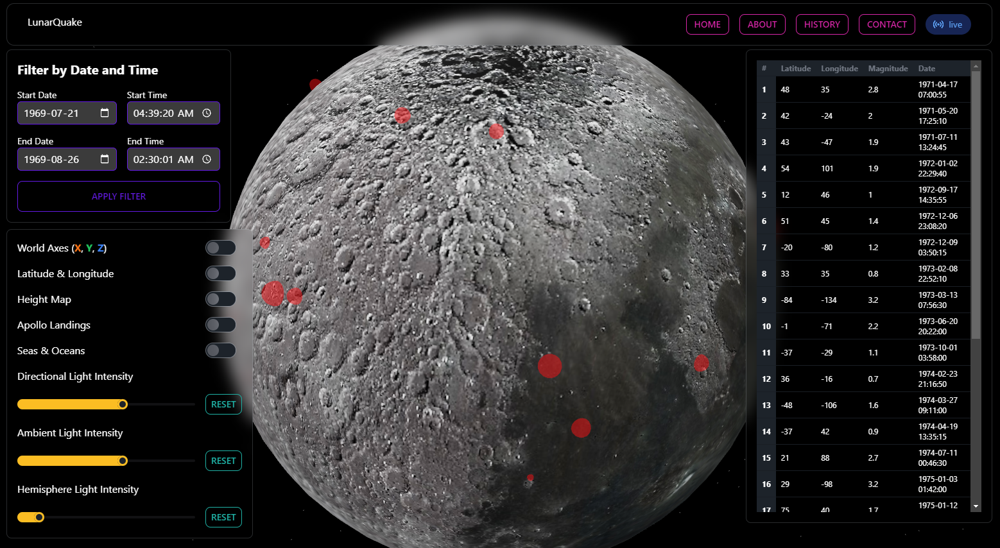

# Lunar Quake

## Project Overview

Submission: https://www.spaceappschallenge.org/2023/find-a-team/lunar-quake/?tab=project

Live Demo: https://lunar-quake.vercel.app/

Lunar Quake is an innovative web application developed to visualize the seismic data collected from NASA's Apollo missions. By presenting this data on a 3D digital moon globe, we strive to make the intricate details of lunar seismic activities accessible and engaging for all.

## Objective

The primary aim is to provide an interactive experience for users to explore and understand the lunar seismic activities. Through this, we hope to enhance public awareness about space exploration and the invaluable data it has provided over the years.

## Scope

- Render a 3D representation of the moon.
  
- Plot seismic events based on date, magnitude, depth, and type on the moon globe.
  
- Allow users to interact with the visualizations through tooltips and modals, displaying detailed information about specific events.
  
- Offer a time-lapse feature for users to witness the pattern of moonquakes over time.

## Technologies Used

- **Front-End**: Next.js, Three.js, Tailwind CSS, Tremor, DaisyUI

## Benefits

- **Educational**: Provides an intuitive platform for learners, researchers, and space enthusiasts to understand lunar seismic activities.
  
- **Engagement**: The interactive 3D visualization offers users an immersive experience, promoting engagement and exploration.
  
- **Awareness**: Enhances public appreciation for space exploration and the rich data it yields.
  
- **Open Source**: As an open-source project, it encourages community contributions, fostering collaboration and continuous improvement.

## Team

- **Rafi Khan** <rafi@rafikhan.io>: Data Processing.
  
- **Alif Chowdhury** <chowdhury.alif@gmail.com>: Research Anaylyst, Data Processing. 
  
- **Ximing Yu**: Data modelling and API integration.

- **Mumtahin Farabi** <mfarabi619@gmail.com>: Front-End Developer
  
